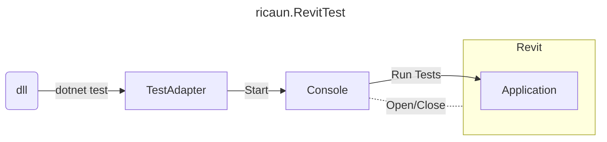

# ricaun.RevitTest

ricaun.RevitTest is a Framework to execute NUnit tests using Visual Studio and Revit.

[](https://github.com/ricaun-io/ricaun.RevitTest)
[](https://github.com/ricaun-io/ricaun.RevitTest)
[](https://nuke.build/)
[](LICENSE)
[](https://github.com/ricaun-io/ricaun.RevitTest/actions)

## WorkFlow



## Tests
### PackageReference 
```xml
<PackageReference Include="NUnit" Version="3.13.3" />
<PackageReference Include="ricaun.RevitTest.TestAdapter" Version="*" />
```

### PropertyGroup
```xml
<IsTestProject>true</IsTestProject>
```


## Installation

* Download and install [ricaun.RevitTest.Console.exe](https://github.com/ricaun-io/ricaun.RevitTest/releases/latest/download/ricaun.RevitTest.Console.zip)

### RevitTest

#### Application
* [ricaun.NUnit](https://github.com/ricaun-io/ricaun.NUnit)
* [ricaun.Revit.UI](https://github.com/ricaun-io/ricaun.Revit.UI)
* [ricaun.Revit.Async](https://github.com/ricaun-io/ricaun.Revit.Async)
* [Revit.Busy](https://github.com/ricaun-io/Revit.Busy)
* [ricaun.RevitTest.Shared](ricaun.RevitTest.Shared)
#### Console
* [ricaun.RevitTest.Command](ricaun.RevitTest.Command)
* [ricaun.RevitTest.Shared](ricaun.RevitTest.Shared)
* [ricaun.RevitTest.Application.bundle.zip](ricaun.RevitTest.Application)
#### Command
* [ricaun.NUnit](https://github.com/ricaun-io/ricaun.NUnit)
* [ricaun.Revit.Installation](https://github.com/ricaun-io/ricaun.Revit.Installation)
#### Shared
* [ricaun.NUnit](https://github.com/ricaun-io/ricaun.NUnit)
* [NamedPipeWrapper.Json](https://github.com/ricaun-io/named-pipe-wrapper-json)
#### TestAdapter
* [ricaun.RevitTest.Console.exe](ricaun.RevitTest.Console)

## CommandLine

```bash
.\ricaun.RevitTest.Console.exe --help
.\ricaun.RevitTest.Console.exe --version
```

### Read
```bash
.\ricaun.RevitTest.Console.exe --file "C:\Users\ricau\source\repos\TestProject.Tests\TestProject.Tests\bin\Debug\TestProject.Tests.dll" --read
.\ricaun.RevitTest.Console.exe --file "C:\Users\ricau\source\repos\TestProject.Tests\TestProject.Tests\bin\Debug\TestProject.Tests.dll" --read --output "output.json"
```

### Test
```bash
.\ricaun.RevitTest.Console.exe --file "C:\Users\ricau\source\repos\TestProject.Tests\TestProject.Tests\bin\Debug\TestProject.Tests.dll" --output "console"
.\ricaun.RevitTest.Console.exe --file "C:\Users\ricau\source\repos\TestProject.Tests\TestProject.Tests\bin\Debug\TestProject.Tests.dll" -v 2021 -o "console" --close
```

### Test Language
```bash
.\ricaun.RevitTest.Console.exe --file "C:\Users\ricau\source\repos\TestProject.Tests\TestProject.Tests\bin\Debug\TestProject.Tests.dll" -v 2021 -l -o "console" --language "PTB" --open --close
.\ricaun.RevitTest.Console.exe --file "D:\Users\ricau\source\repos\RevitTest.Language\RevitTest.Language\bin\Debug\net45\RevitTest.Language.dll" -v 2021 -l -o "console" --language "PTB" --open --close
```

```
.\ricaun.RevitTest.Console\bin\Debug\ricaun.RevitTest.Console.exe --file "D:\Users\ricau\source\repos\RevitTest0\RevitTest0\bin\Debug\RevitTest0.dll" -v 2021 -o "console"
```

## Tests
### PackageReference 

* `ricaun.RevitTest.TestAdapter`
* `NUnit` need to be 3.13.3
* `IsTestProject` true

### `dotnet test`
```bash
dotnet test ricaun.RevitTest.Tests.dll -- NUnit.Version=2021 NUnit.Open=true NUnit.Close=true
```
```bash
dotnet test ricaun.RevitTest.Tests.dll -v:detailed -- NUnit.Version=2021 NUnit.Open=True NUnit.Close=True NUnit.Verbosity=1
```
```bash
dotnet test ricaun.RevitTest.Tests.dll --verbosity Normal -- NUnit.Verbosity=2 NUnit.Open=True NUnit.Close=True
```
```bash
dotnet test ricaun.RevitTest.Tests.dll --settings:.runsettings
```
```bash
dotnet test ricaun.RevitTest.Tests.dll --settings:.runsettings -- NUnit.Version=2023
```

### `.runsettings`
.csproj
```xml
<!--.runsettings-->
<PropertyGroup>
  <RunSettingsFilePath>$(MSBuildProjectDirectory)\.runsettings</RunSettingsFilePath>
</PropertyGroup>
<ItemGroup>
  <None Update=".runsettings">
    <CopyToOutputDirectory>PreserveNewest</CopyToOutputDirectory>
  </None>
</ItemGroup>
```
.runsettings
```xml
<?xml version="1.0" encoding="utf-8"?>
<RunSettings>
  <NUnit>
    <Version>2021</Version>
    <Open>true</Open>
    <Close>true</Close>
    <Verbosity>1</Verbosity>
    <Application></Application>
    <Metadata>false</Metadata>
  </NUnit>
</RunSettings>
```

### AssemblyMetadata
.cs
```c#
[assembly: AssemblyMetadata("NUnit.Version", "2021")]
[assembly: AssemblyMetadata("NUnit.Open", "true")]
[assembly: AssemblyMetadata("NUnit.Close", "true")]
[assembly: AssemblyMetadata("NUnit.Verbosity", "1")]
```
.csproj
```xml
<!-- Release -->
<ItemGroup Condition="!$(Configuration.Contains('Debug'))">
  <AssemblyAttribute Include="System.Reflection.AssemblyMetadataAttribute">
    <_Parameter1>NUnit.Open</_Parameter1>
    <_Parameter2>true</_Parameter2>
  </AssemblyAttribute>
  <AssemblyAttribute Include="System.Reflection.AssemblyMetadataAttribute">
    <_Parameter1>NUnit.Close</_Parameter1>
    <_Parameter2>true</_Parameter2>
  </AssemblyAttribute>
</ItemGroup>
```


## License

This project is [licensed](LICENSE) under the [MIT Licence](https://en.wikipedia.org/wiki/MIT_License).

---

Do you like this project? Please [star this project on GitHub](https://github.com/ricaun-io/ricaun.RevitTest/stargazers)!